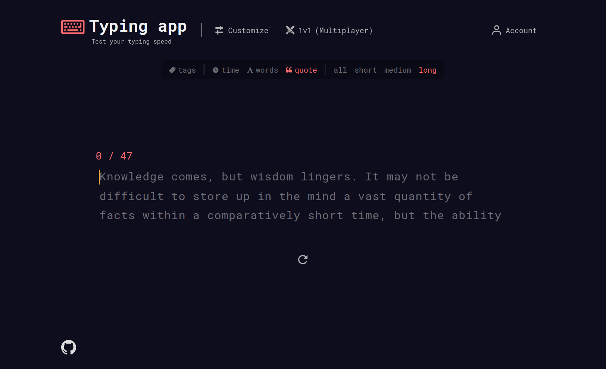
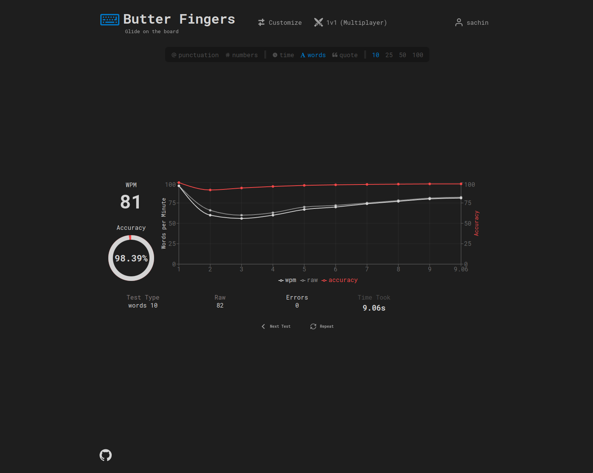

<details>
  <summary>Table of Contents</summary>
  <ul>
    <li>
      <a href="#about-the-project">About The Project</a>
      <ul>
        <li><a href="#description">Description</a></li>
        <li><a href="#built-with">Built With</a></li>
      </ul>
    </li>
    <li><a href="#getting-started">Getting Started</a></li>
    <li><a href="#acknowledgments">Acknowledgments</a></li>
  </ul>
</details>

## About The Project



### Built with

- [![TypeScript][typescript-image]][typescript-url]
- [![React][react-image]][react-url]
- [![Sass][sass-image]][sass-url]
- [![Socket.io][socketio-image]][socketio-url]
- [![Google OAuth][google-oauth-image]][google-oauth-url]
- [![GitHub OAuth][github-oauth-image]][github-oauth-url]

### Description

- Custom made smooth typing input that displays errors as you type.
- Different typing modes, such as 'time', 'words', 'quote'.
- Multiplayer 1v1 mode to play against your friends.
- Fetches Random quotes using 'quotable' API.
- Results after typing is done, including WPM, Accuracy, Errors, Interactive Dashboard.
- User can customize the app to their liking.
- Various app color themes.
- User can create account that will be saved on database, including Google OAuth & GitHub OAuth.
- Personal stats, history and customizations will be saved to the account.



## Getting Started

1. Clone the repository, and move to the root directory of the project

```sh
git clone https://github.com/jet-black-ninja/butterfingers2-frontend
```

&nbsp;

2. Add environment variables
   > [!NOTE]  
   > If you only want to run the client, you can skip this step.
   > Authentication will not work unless you add these variables.

For Google OAuth:

```
VITE_GOOGLE_CLIENT_ID=<your-google-client-id>
```

For GitHub OAuth:

```
VITE_GITHUB_CLIENT_ID=<your-github-client-id>
```

&nbsp;

1. Install NPM packages (handles both client & server packages)

```sh
npm run install-all
```

&nbsp;

4. Run the app locally

```sh
npm run dev
```

## Acknowledgments

- [random-words](https://github.com/apostrophecms/random-words)
- [quoteSlate API](https://github.com/Musheer360/QuoteSlate)
- Inspired by [monkeytype](https://monkeytype.com/) and [Luka Kobaidze](https://github.com/LukaKobaidze/typing-app)

[typescript-image]: https://shields.io/badge/TypeScript-3178C6?logo=TypeScript&logoColor=FFF&style=for-the-badge
[react-image]: https://img.shields.io/badge/React-20232A?style=for-the-badge&logo=react&logoColor=61DAFB
[sass-image]: https://img.shields.io/badge/Sass-CC6699?style=for-the-badge&logo=sass&logoColor=white
[socketio-image]: https://img.shields.io/badge/Socket.io-010101?&style=for-the-badge&logo=Socket.io&logoColor=white
[google-oauth-image]: https://shields.io/badge/Google%20OAuth-f2f2f2?logo=google&logoColor=4285F4&style=for-the-badge
[github-oauth-image]: https://shields.io/badge/GitHub%20OAuth-000000?logo=github&logoColor=ffffff&style=for-the-badge
[typescript-url]: https://www.typescriptlang.org/
[react-url]: https://react.dev/
[sass-url]: https://sass-lang.com/
[socketio-url]: https://socket.io/
[google-oauth-url]: https://developers.google.com/identity/protocols/oauth2
[github-oauth-url]: https://docs.github.com/en/apps/oauth-apps/building-oauth-apps/authorizing-oauth-apps
